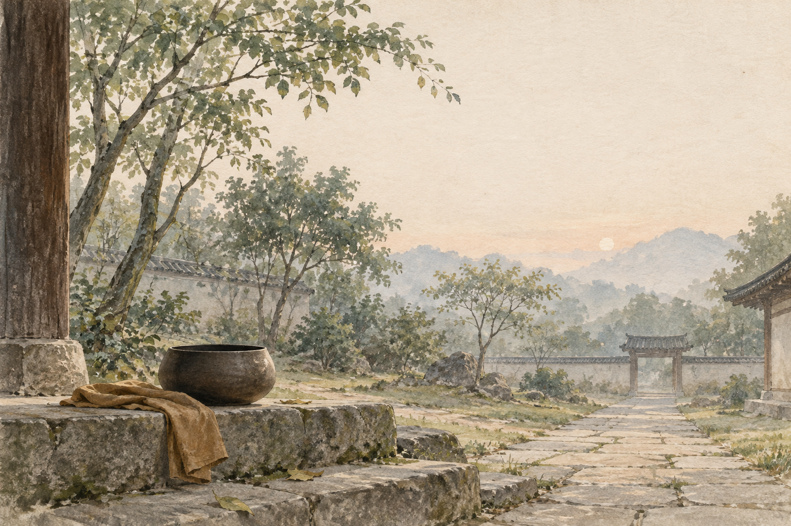

# 法会因由分第一

如是我闻。一时，佛在舍卫国祇树给孤独园，与大比丘众千二百五十人俱。尔时，世尊食时，著衣持钵，入舍卫大城乞食。于其城中，次第乞已，还至本处。饭食讫，收衣钵，洗足已，敷座而坐。

## 原文

如是我闻。一时，佛在舍卫国祇树给孤独园，与大比丘众千二百五十人俱。尔时，世尊食时，著衣持钵，入舍卫大城乞食。于其城中，次第乞已，还至本处。饭食讫，收衣钵，洗足已，敷座而坐。

## 朗读停顿

如是我闻。 / 一时，佛在舍卫国祇树给孤独园，与大比丘众千二百五十人俱。 / 尔时，世尊食时，著衣持钵，入舍卫大城乞食。 / 于其城中，次第乞已，还至本处。 / 饭食讫，收衣钵，洗足已，敷座而坐。

## 关键词链

法会起点 → 舍卫城 → 乞食 → 敷座

## 句义

经文从一场具体的早晨法会开始：佛入城乞食，回来洗足敷座。般若不是离开日常才出现，而是在日常动作里开始被听见。

## 段落作用

[骨] 先交代说法的地点、人物和日常动作，让般若从可见生活开始。

## 记忆锚点

清晨的钵、回到树园、洗足敷座：先把心放回现场。

## 词义抓手

如是我闻：我这样听闻到；祇树给孤独园：舍卫城的精舍所在；大比丘众：大批比丘僧团

## 配图记忆作用

清晨的钵、回到树园、洗足敷座：先把心放回现场。 场景为教学类比，不是经文历史事件或宗教实相图。

---

本卡为离线学习初稿；底本与出处见 README。
