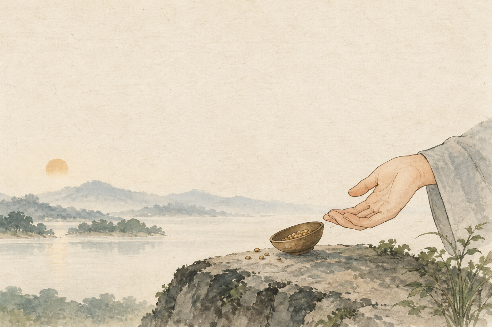

# 大乘正宗分第三

佛告须菩提：「诸菩萨摩诃萨，应如是降伏其心：所有一切众生之类，若卵生、若胎生、若湿生、若化生；若有色、若无色；若有想、若无想、若非有想非无想，我皆令入无余涅槃而灭度之。如是灭度无量无数无边众生，实无众生得灭度者。何以故？须菩提！若菩萨有我相、人相、众生相、寿者相，即非菩萨。」

## 原文

佛告须菩提：「诸菩萨摩诃萨，应如是降伏其心：所有一切众生之类，若卵生、若胎生、若湿生、若化生；若有色、若无色；若有想、若无想、若非有想非无想，我皆令入无余涅槃而灭度之。如是灭度无量无数无边众生，实无众生得灭度者。何以故？须菩提！若菩萨有我相、人相、众生相、寿者相，即非菩萨。」

## 朗读停顿

佛告须菩提：「诸菩萨摩诃萨，应如是降伏其心：所有一切众生之类，若卵生、若胎生、若湿生、若化生；若有色、若无色；若有想、若无想、若非有想非无想，我皆令入无余涅槃而灭度之。 / 如是灭度无量无数无边众生，实无众生得灭度者。 / 何以故？ / 须菩提！ / 若菩萨有我相、人相、众生相、寿者相，即非菩萨。 / 」

## 关键词链

一切众生 → 灭度 → 无众生 → 四相

## 句义

愿意让一切众生入无余涅槃，却不把自己想成‘我度了众生’；真正的菩萨愿与无我相同时成立。

## 段落作用

[骨] 把广大救度愿与无相智慧放在一起，防止慈悲变成自我功劳。

## 记忆锚点

许多小灯同时亮起，却没有一盏灯把功劳据为己有。

## 词义抓手

菩萨摩诃萨：大菩萨；无余涅槃：彻底寂灭的解脱境界；我相：把自我当成固定实体的相；人相：把人我关系实化的相；众生相：把众生类别实化的相；寿者相：把生命主体实化的相

## 配图记忆作用

许多小灯同时亮起，却没有一盏灯把功劳据为己有。 场景为教学类比，不是经文历史事件或宗教实相图。

---

本卡为离线学习初稿；底本与出处见 README。
