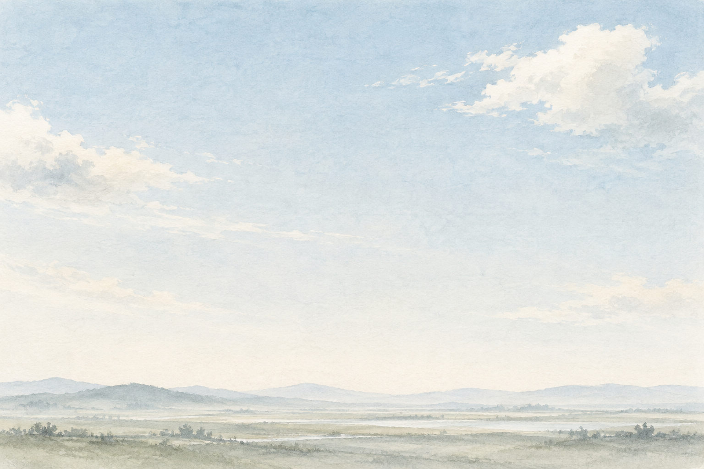

# 无得无说分第七

「须菩提！于意云何？如来得阿耨多罗三藐三菩提耶？如来有所说法耶？」须菩提言：「如我解佛所说义，无有定法，名『阿耨多罗三藐三菩提』，亦无有定法，如来可说。何以故？如来所说法。皆不可取、不可说；非法，非非法。所以者何？一切贤圣，皆以无为法而有差别。」

## 原文

「须菩提！于意云何？如来得阿耨多罗三藐三菩提耶？如来有所说法耶？」须菩提言：「如我解佛所说义，无有定法，名『阿耨多罗三藐三菩提』，亦无有定法，如来可说。何以故？如来所说法。皆不可取、不可说；非法，非非法。所以者何？一切贤圣，皆以无为法而有差别。」

## 朗读停顿

「须菩提！ / 于意云何？ / 如来得阿耨多罗三藐三菩提耶？ / 如来有所说法耶？ / 」须菩提言：「如我解佛所说义，无有定法，名『阿耨多罗三藐三菩提』，亦无有定法，如来可说。 / 何以故？ / 如来所说法。 / 皆不可取、不可说；非法，非非法。 / 所以者何？ / 一切贤圣，皆以无为法而有差别。 / 」

## 关键词链

无定法 → 不可取说 → 无为差别

## 句义

觉悟没有一个可以占有的固定法，也不能被一句话封存；贤圣的差别仍然存在于对无为法的实践中。

## 段落作用

[骨] 以无定法说明觉悟不可被占有为一个固定对象，仍保留修行差别。

## 记忆锚点

指向远方的手停在半空，没有把方向抓成物件。

## 词义抓手

阿耨多罗三藐三菩提：无上正等正觉；阿耨多罗：无上；三藐三菩提：正等正觉

## 配图记忆作用

指向远方的手停在半空，没有把方向抓成物件。 场景为教学类比，不是经文历史事件或宗教实相图。

---

本卡为离线学习初稿；底本与出处见 README。
