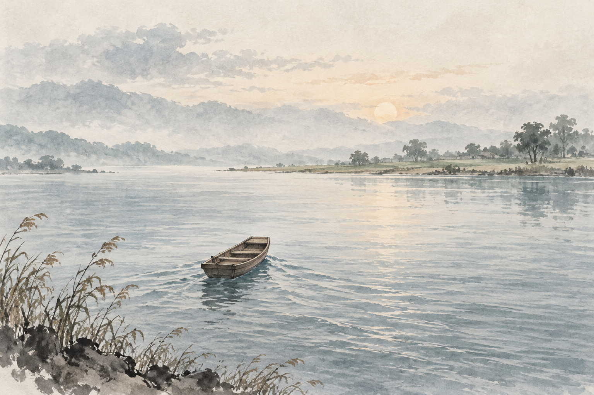

# 第27分翻译 · 无断无灭分第二十七

「须菩提！汝若作是念：『如来不以具足相故，得阿耨多罗三藐三菩提。』须菩提！莫作是念：『如来不以具足相故，得阿耨多罗三藐三菩提。』」「须菩提！汝若作是念，发阿耨多罗三藐三菩提心者，说诸法断灭。莫作是念！何以故？发阿耨多罗三藐三菩提心者。于法不说断灭相。」

## 原文

「须菩提！汝若作是念：『如来不以具足相故，得阿耨多罗三藐三菩提。』须菩提！莫作是念：『如来不以具足相故，得阿耨多罗三藐三菩提。』」「须菩提！汝若作是念，发阿耨多罗三藐三菩提心者，说诸法断灭。莫作是念！何以故？发阿耨多罗三藐三菩提心者。于法不说断灭相。」

## 句群直译线索

「须菩提！；汝若作是念：『如来不以具足相故，得阿耨多罗三藐三菩提。；』须菩提！；莫作是念：『如来不以具足相故，得阿耨多罗三藐三菩提。；』」「须菩提！；汝若作是念，发阿耨多罗三藐三菩提心者，说诸法断灭。

## 自然白话

不以具足相得菩提，并不等于断灭诸法。离相仍要发心、行善、修持，不能把空读成什么都不用做。

## 关键虚词、活用和结构

应：应当；若：假设；故：因为这样；即非／是名：先立名再破除实执

## 容易误解

本分的‘无’、‘非’多在破除固定自性，不等于把日常因果和行动全部抹掉；宗教果报句按经文语境读，不替代现实判断。

## 一句话记忆画面

桥不被抓成永恒，河也没有因此消失；仍然要过桥。

---

本卡为离线学习初稿；底本与出处见 README。
